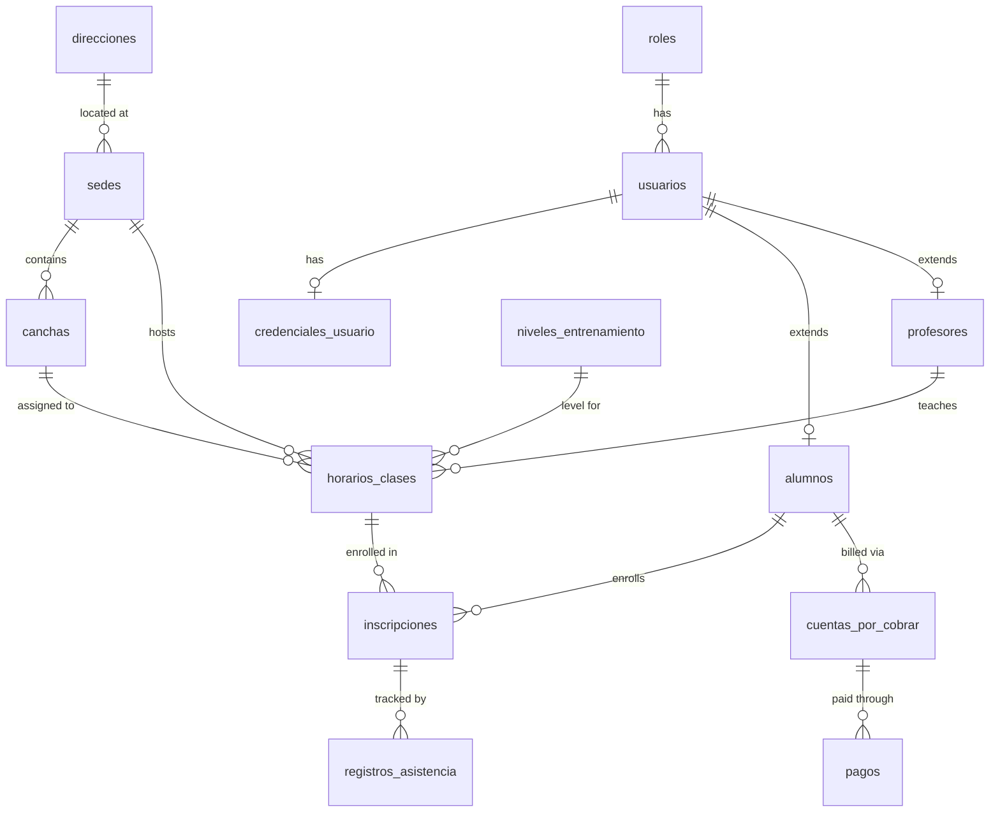

Academia Gema uses a single PostgreSQL database organized into five logical sections: user identity and authentication, extended role profiles, academic infrastructure, operations (enrollments and attendance), and financials.

## Tables

| Table | Description |
|---|---|
| `roles` | Defines user roles: `ADMIN`, `PROFESOR`, `ALUMNO`. |
| `usuarios` | Core user record shared across all roles. |
| `credenciales_usuario` | Hashed password, login tracking, and account lockout. |
| `alumnos` | Student-specific profile extension (emergency contact, medical info). |
| `profesores` | Professor-specific profile extension (specialization, hourly rate). |
| `direcciones` | Normalized address records used by venues. |
| `sedes` | Physical academy venues/locations. |
| `canchas` | Courts within a venue. |
| `niveles_entrenamiento` | Training levels with associated monthly pricing. |
| `horarios_clases` | Class schedules: which court, professor, level, day, and time. |
| `inscripciones` | Student enrollments in class schedules. |
| `registros_asistencia` | Daily attendance records per enrollment. |
| `cuentas_por_cobrar` | Accounts receivable: charges generated for students. |
| `pagos` | Payment records reporting money applied to an account. |

## Entity relationships



### Key relationship notes

- A `usuario` belongs to exactly one `role`. The `alumnos` and `profesores` tables each extend `usuarios` using a 1-to-1 relationship via `usuario_id` as their primary key.
- A `sede` (venue) requires a `direccion`. Courts (`canchas`) belong to a `sede`.
- A class schedule (`horarios_clases`) ties together a `sede`, a `cancha`, a `profesor`, and a `nivel_entrenamiento` at a specific day and time.
- An enrollment (`inscripcion`) links an `alumno` to a `horario_clase`. Each class session generates one attendance record (`registro_asistencia`) per enrollment.
- A `cuenta_por_cobrar` represents a charge for a student. Payments (`pagos`) are applied against it.

## Key constraints

| Constraint | Table | Columns | Purpose |
|---|---|---|---|
| `UNIQUE` on `nombre` | `roles` | `nombre` | Prevents duplicate role names. |
| `UNIQUE` on `email` | `usuarios` | `email` | Each email maps to exactly one user. |
| `unica_cancha_hora` | `horarios_clases` | `cancha_id, dia_semana, hora_inicio` | Prevents double-booking a court. |
| `unica_inscripcion_alumno` | `inscripciones` | `alumno_id, horario_id` | A student can only be enrolled once per schedule. |
| `asistencia_unica_diaria` | `registros_asistencia` | `inscripcion_id, fecha` | One attendance record per student per class day. |
| `CHECK` on `dia_semana` | `horarios_clases` | `dia_semana` | Must be between `1` and `7`. |
| `CHECK` on `estado` | `inscripciones` | `estado` | Must be `ACTIVO`, `SUSPENDIDO`, or `RETIRADO`. |
| `CHECK` on `estado` | `registros_asistencia` | `estado` | Must be `PRESENTE`, `AUSENTE`, `TARDE`, or `JUSTIFICADO`. |
| `CHECK` on `estado` | `cuentas_por_cobrar` | `estado` | Must be `PENDIENTE`, `PARCIAL`, `PAGADO`, `VENCIDO`, or `CANCELADO`. |

## Database triggers

Three triggers automatically update the `actualizado_en` column before any `UPDATE` operation:

| Trigger | Table |
|---|---|
| `trg_actualizar_usuarios` | `usuarios` |
| `trg_actualizar_cuentas` | `cuentas_por_cobrar` |
| `trg_actualizar_inscripciones` | `inscripciones` |

All three use the same `actualizar_columna_timestamp()` function:

```sql
CREATE OR REPLACE FUNCTION actualizar_columna_timestamp()
RETURNS TRIGGER AS $$
BEGIN
    NEW.actualizado_en = NOW();
    RETURN NEW;
END;
$$ language 'plpgsql';
```

## Performance indexes

| Index | Table | Column(s) | Purpose |
|---|---|---|---|
| `idx_usuarios_email` | `usuarios` | `email` | Fast login lookups by email. |
| `idx_usuarios_apellidos` | `usuarios` | `apellidos` | Fast user search by last name. |
| `idx_inscripciones_alumno` | `inscripciones` | `alumno_id` | Find all enrollments for a student. |
| `idx_inscripciones_horario` | `inscripciones` | `horario_id` | Find all students in a schedule. |
| `idx_asistencia_inscripcion` | `registros_asistencia` | `inscripcion_id` | Retrieve attendance history for an enrollment. |
| `idx_cuentas_alumno` | `cuentas_por_cobrar` | `alumno_id` | List all charges for a student. |
| `idx_cuentas_estado_fecha` | `cuentas_por_cobrar` | `estado, fecha_vencimiento` | Filter overdue or pending accounts efficiently. |
| `idx_direcciones_ciudad` | `direcciones` | `ciudad` | Search venues by city. |
