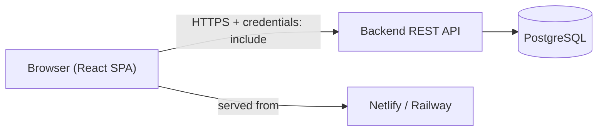

Academia Gema's frontend is a React single-page application (SPA) built with Vite. It communicates with a separate backend REST API and a PostgreSQL database.

## Architecture



| Layer | Technology | Notes |
|---|---|---|
| Frontend | React 19, Vite 7, React Router v7, Tailwind CSS v3 | Built to a static `dist/` folder. |
| API | Backend REST service | URL set via `VITE_API_URL` at build time. |
| Database | PostgreSQL | Schema in `BD/clubGema.sql`. |

## Node.js requirement

The project requires **Node.js ≥ 22.12.0**, as specified in `package.json`:

```json
{
  "engines": {
    "node": ">=22.12.0"
  }
}
```

<Warning>
  Using an older Node.js version may cause build failures or unexpected runtime behavior. Use `node --version` to verify before deploying.
</Warning>

## Hosting options

<CardGroup cols={2}>
  <Card title="Netlify" icon="globe" href="/deployment/frontend#netlify">
    Static hosting with automatic deploys from Git. The `netlify.toml` file is already configured. Best for production.
  </Card>
  <Card title="Railway" icon="server" href="/deployment/frontend#railway">
    Container-based hosting using Nixpacks. The `railway.json` is already configured. Runs the Vite preview server. Useful for staging.
  </Card>
</CardGroup>

## Build output

Running `npm run build` produces a `dist/` directory containing the fully bundled static assets:

```bash
npm run build
# Output: dist/
```

For the Vite preview server (Railway), `npm start` runs:

```bash
vite preview --host 0.0.0.0 --port ${PORT:-4173}
```

## Environment variables

One environment variable is required at build time:

| Variable | Required | Description |
|---|---|---|
| `VITE_API_URL` | Yes | Base URL of the backend REST API. |

See [Environment variables](/deployment/environment-variables) for the full reference and platform-specific setup instructions.

## Deployment guides

<CardGroup cols={2}>
  <Card title="Frontend deployment" icon="upload" href="/deployment/frontend">
    Step-by-step instructions for Netlify, Railway, and manual VPS deployments.
  </Card>
  <Card title="Environment variables" icon="key" href="/deployment/environment-variables">
    Full reference for all environment variables with example `.env` file.
  </Card>
</CardGroup>
